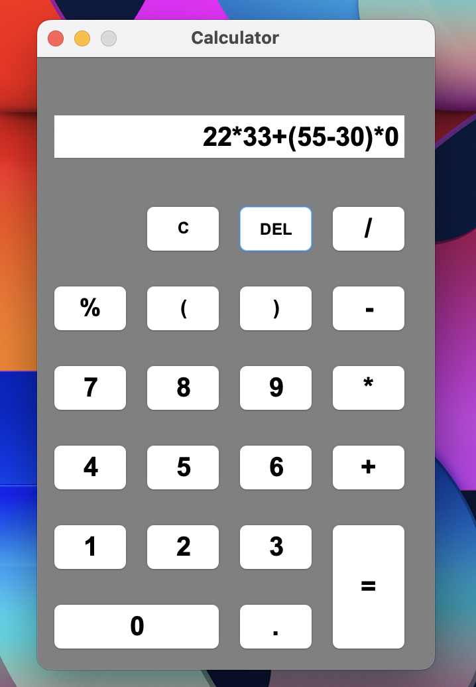

Calculator
----------
1. Here we have used swings and AWT to build the UI.
2. Then from the UI we get the Expression from the user.
3. Then we use ScriptEngineManager to evaluate the Expression.

<b>We have [ 2*-1 ] ||  [ 2/-1 ] feature which even mobile calculators does not have.</b>